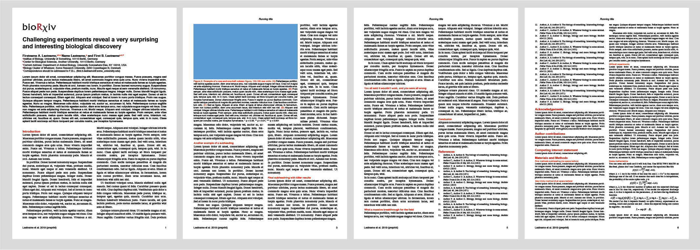
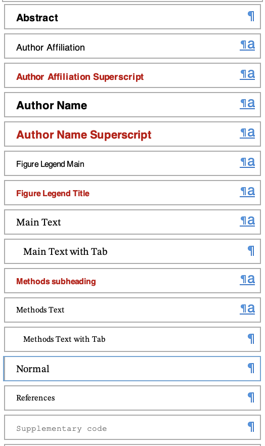
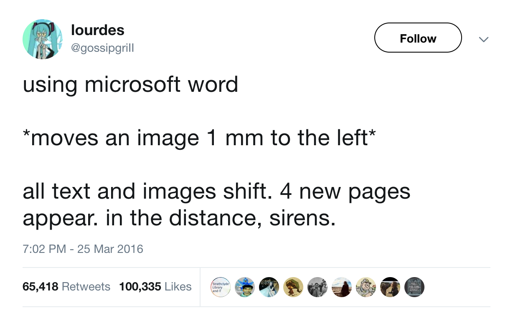

# This is a bioRxiv template for Microsoft Word.


Many journals still require manuscripts as a doc file and many PIs in the biological sciences don't use [LaTeX](https://en.wikipedia.org/wiki/LaTeX). For these reasons, we are sometimes forced to write papers in MS Word.

Here is a template to style a manuscript in MS Word for a bioRxiv submission. The design of the template was inspired by the look of [Teves et al. bioRxiv 2018](https://doi.org/10.1101/257451) and by [another bioRxiv template](https://github.com/finkelsteinlab/BioRxiv-Template) by @finkelsteinlab. For an example of a paper typeset using this template style see [Ebbesen et al. bioRxiv 2019](https://doi.org/10.1101/545434)

The template uses a sans serif font (Helvetica) for headings and the abstract and a serif font ([Stix Two Text](https://github.com/stipub/stixfonts)) for the rest. The serif font is free and has full unicode coverage for math symbols ([Stix Two Math](https://github.com/stipub/stixfonts)) and is thus fully compatible with the MS Word equation editor. No more Times New Roman text with Cambria math! The template is for A4 paper.

Instructions:
* Install Helvetica (or a similar sans serif font) and the [Stix Two](https://github.com/stipub/stixfonts) font family (Text and Math) before using the template.

* Style the document using the MS Word "Style Gallery". The various styles are named and should be fairly self-explanatory. If your document is already "styled", you should be able to apply the template easily. MS Word isn't really scriptable and equation styling is pretty horrific, so some things may have to be edited manually.




* Change the font of all equations to "Stix Two Math". It can be convenient to [change the default font](https://superuser.com/questions/1114697/select-a-different-math-font-in-microsoft-word).  Annoyingly, there is no easy way to select all equations in a MS Word document. If the main text is in English and does not require special language glyphs, the whole main text can be typeset with "Stix Two Math" and there is need to select just equations. Selecting equations [is possible (sort of)](https://www.extendoffice.com/documents/word/751-word-select-equation.html) by opening the "Microsoft Visual Basic for Applications" window (alt/option+F11) and executing (click Insert > Module, then F5 to run):

  ```
  Sub SelectAllEquations()
  Dim xMath As OMath
  Dim I As Integer
  With ActiveDocument
      .DeleteAllEditableRanges wdEditorEveryone
      For I = 1 To .OMaths.Count
          Set xMath = .OMaths.Item(I)
          xMath.Range.Paragraphs(1).Range.Editors.Add wdEditorEveryone
      Next
      .SelectAllEditableRanges wdEditorEveryone
      .DeleteAllEditableRanges wdEditorEveryone
  End With
  End Sub
  ```

  If your main text does not use bold or italics, you can also just select a whole paragraph and change the font of everything to "Stix Two Math" – it will look the same.


* It looks neat if figures and figure legend text boxes are kept at fixed widths, which correspond to the column widths. The columns are 89 mm wide with 5.9 mm spacing between them. By default, word will pad images and text boxes with 3.2 mm. Thus, to align with the text, the width of figures and text boxes should be either one-column (89 mm), one-and-one-half-column (139.4 -1.6 mm w. 44.5 - 1.6 mm text box next to it) or double-column (183.9 mm, see examples in the document).

* **TIP: Insert and style all text before adding any figures. Work sequentially.** In contrast to e.g. [LibreOffice](https://www.libreoffice.org/), it is not possible to anchor figures and text boxes to pages in MS Word. Everything is anchored to text. Adding figures can move text from page to page, which [will initiate chaotic motion](https://twitter.com/gossipgriii/status/713425874167537664).



* **ANOTHER TIP:** There is no Helvetica math font, which is compatible with the Word equation editor. So if you want to use Helvetica for the main text and you want to add math symbols or equations, you have a problem. However, there *is* one sans serif unicode font with full math coverage, and it's free on github: [Fire Math](https://github.com/firamath/firamath) (matches the [free FiraGO font family](https://github.com/bBoxType/FiraGO)).
